# EnOcean Alliance DDF Documentation

DDFs are part of the ReCom (Remote Commissioning Specification) and are used to specify the ReCom features of the Device.

Additionally, the DDF is an electronic Datasheet and shall fully describe the capabilities of the device.

For more information click [here](https://www.enocean-alliance.org/specifications/).

This documentation explains the following steps:

- Create a workbench (branch)
- Create DDFs in this branch (commit files)
- Publish these DDFs (Merge into main branch)

---

### Create a workbench (Create a new branch)

To add/ edit products we need to create a new branch, to work inside.

To do so, we “copy” the `main` (current state) branch.

1. Go to `branches` inside the `enocean-alliance-ddf` repository ([https://github.com/EnOcean-Alliance/enocean-alliance-ddf/branches](https://github.com/EnOcean-Alliance/enocean-alliance-ddf/branches)).
2. On the upper right sight click `New Branch`.
    
    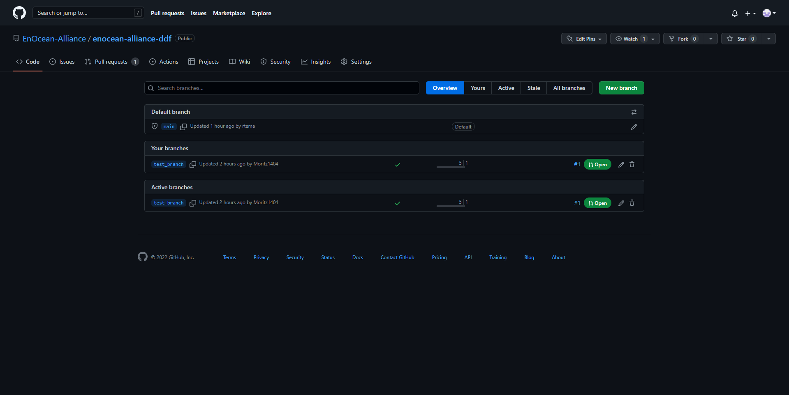
    

1. Now enter a branch name. We recommend to use this formula: `company-name/product-name`.
    
    Always choose `main` as `Branch Source`!
    
    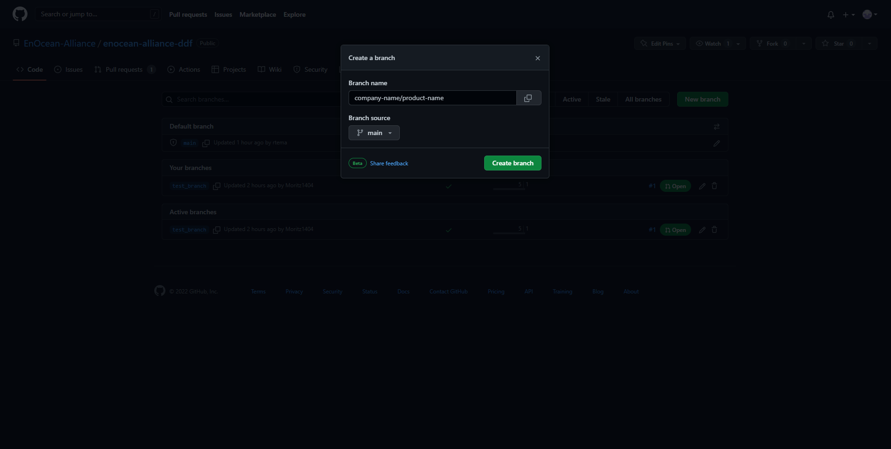
    

---

### Add your DDFs (Commit files into your branch)

Next, we switch to our branch that we just created.

1. To do that, click on the `main` button on the upper left side. A drop-down menu will open.
2. Then select your branch. In our case `company-name/product-name`.
    
    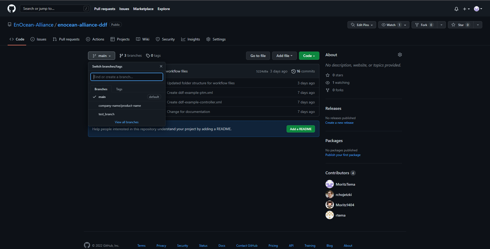
    
    Now we are in our Branch.
    
3. Now go to your company folder.
4. Click `Add file` on the upper right side. Now you can choose whether you want to upload a file or create one directly in the browser.
    
    In this example, we create one in the browser.
    
    If you want to upload/edit DDFs via an IDE/terminal, please refer to the official [GitHub documentation](https://docs.github.com/en).
    
5. In the upper area we can specify the file name. Note: only small letters, numbers and hyphens are allowed. The file must end with `.xml`.
6. Now copy your DDF xml into the large field.
    
    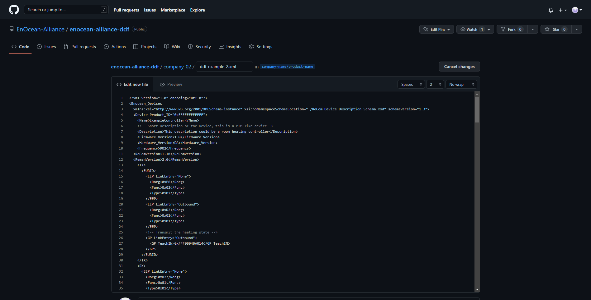
    

1. In the `Commit new file` field, a title and a description are specified. Here should be described what was done.
2. Make sure that `Commit directly to the <branchName> branch.` is selected.
3. Now click `Commit new file`.
    
    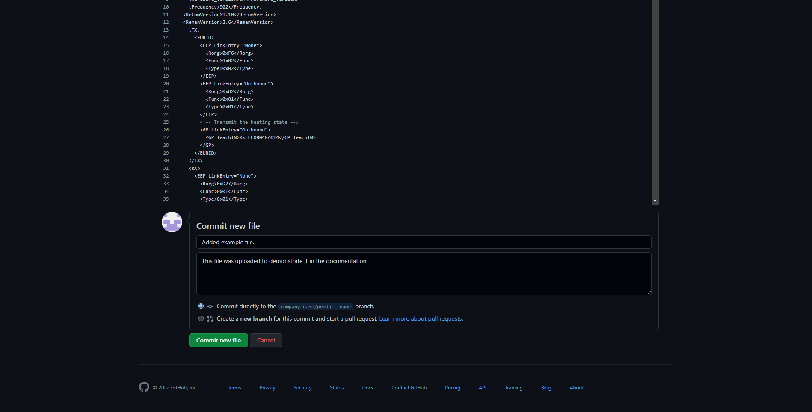
    

**Note: Please note that everything you upload is already publicly viewable.**

---

### Publish your changes (Create a pull request)

When ready, we want to merge our changes from our branch into the `main`branch, so that everyone knows that the DDF is ready for public use.

To do so, we need to create a pull request.

1. Go to `Pull requests` inside the `enocean-alliance-ddf` repository ([https://github.com/EnOcean-Alliance/enocean-alliance-ddf/pulls](https://github.com/EnOcean-Alliance/enocean-alliance-ddf/pulls)).
2. On the upper right sight click `New pull request`.
    
    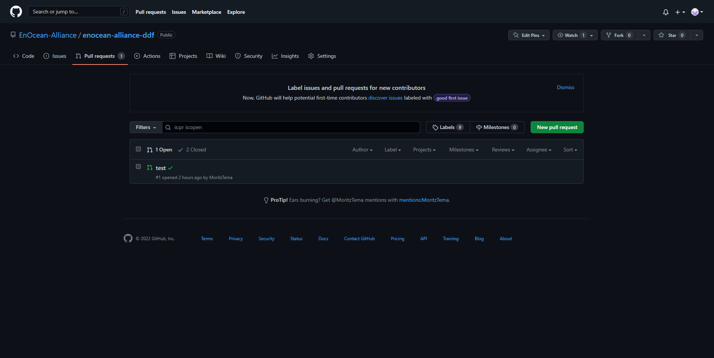
    
3. Now select the branch you want to merge into `main`. (For this example: `company-name/product-name`.)
    
    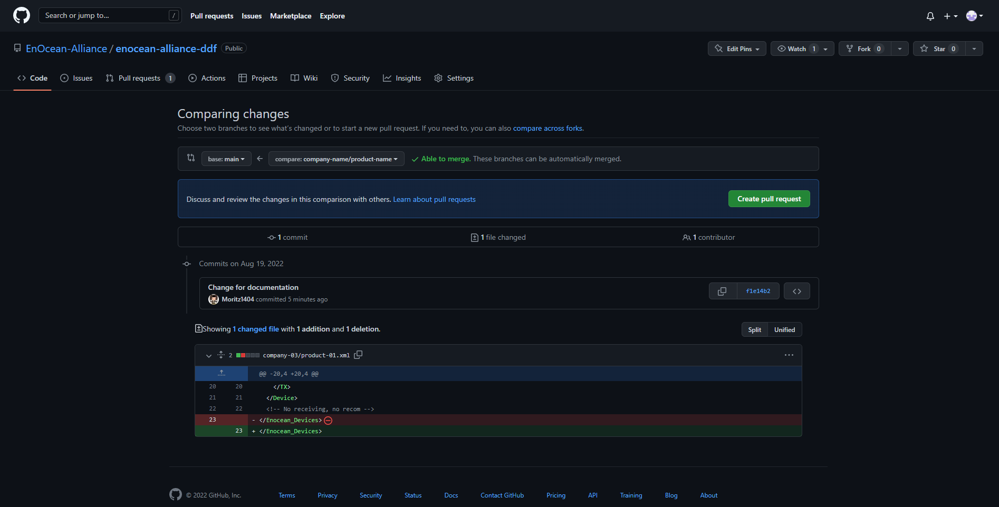
    
    Below that, you can see a history of all changes made inside this branch.
    
4. If everything looks fine, click `Create pull request`.
5. Now you can add a title and a comment to describe your changes.
6. Then click `Create pull request` again.
    
    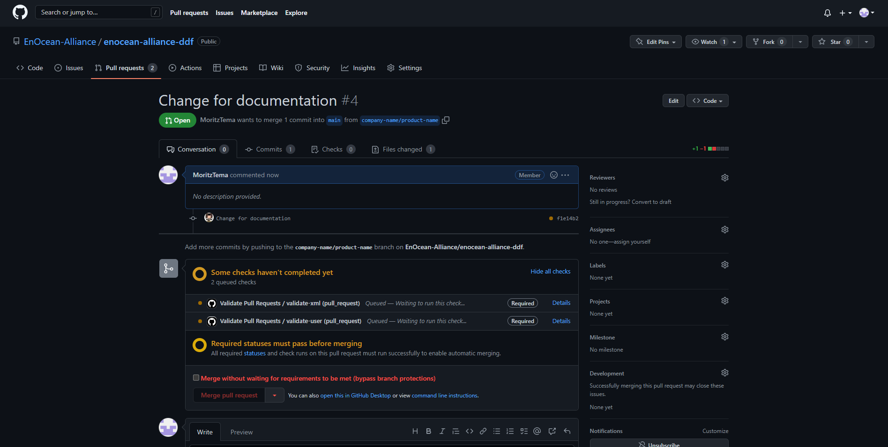
    
    After that your changes will be checked automatically.
    
    `validate-xml` will check the DDFs (xml files) against the schema, to verify if they are correct.
    
    `validate-user` will check if the changes were only made inside the company folders your are authorized for.
    
    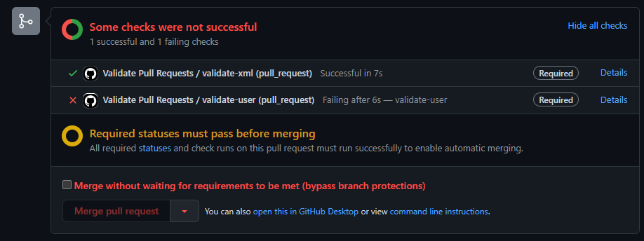
    
    If a check fails, you need to fix the errors inside your branch. Your changes are automatically checked again.
    
    As seen above: `Bypass branch protections` can be used to publish changes without the checks successfully completing. This is only available for administrators.
    

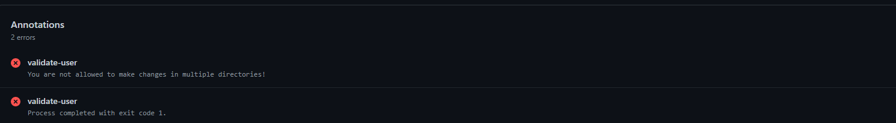

Example error message.

1. When all checks have passed, you are able to merge your pull request.
    
    For that, click `Merge pull request` ⇒ `Confirm merge`. 
    
    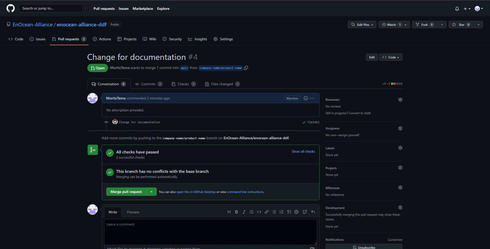
    
2. All changes you made in `company-name/product-name` are now in the `main` branch.
    
    The `company-name/product-name branch` can be safely deleted, to keep the repository clean.
    